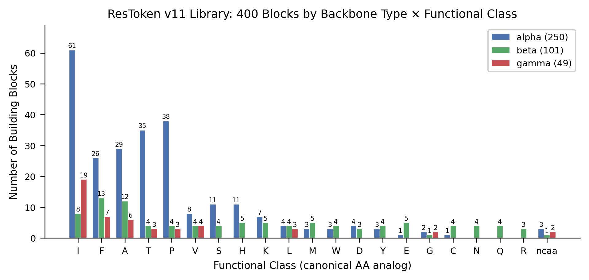
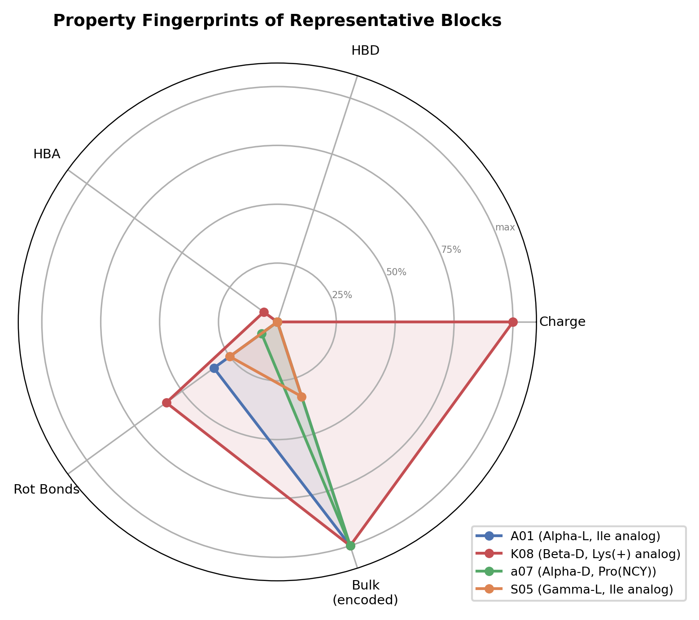
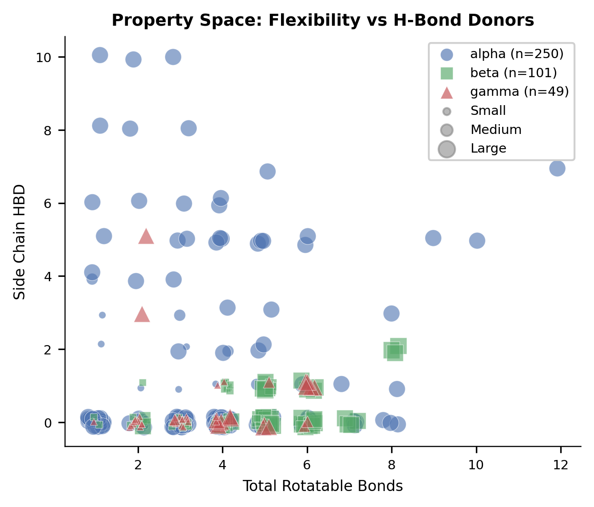
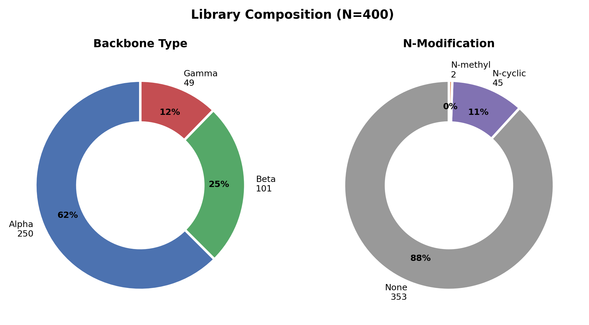
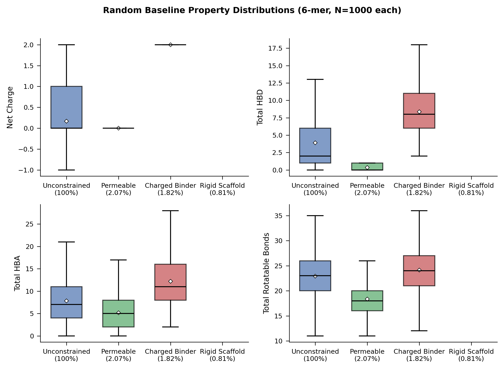

# Supporting Information

## ResToken: A Residue-Semantic Token Library Enabling LLM-Based Design of Noncanonical Cyclic Peptides

---

## Table of Contents

- SI Table S1: Zero-Shot Generation Validity (Experiment 1)
- SI Table S2: Sequence Diversity (Experiment 1)
- SI Table S3: Positional Controllability (Experiment 2)
- SI Table S4: Property-Constrained Generation (Experiment 3)
- SI Table S5: Combined Benchmark Summary
- SI Table S6: Bootstrap Confidence Intervals for Validity (Experiment 1)
- SI Table S7: Chi-Square Tests — ResToken vs Baselines (Experiment 1)
- SI Table S8: Enrichment over Random Baselines (Experiment 3)
- SI Figure S1: Building Block Library Coverage
- SI Figure S2: Property Fingerprint Radar Charts
- SI Figure S3: Generated Peptide Property Distributions
- SI Figure S4: Library Composition
- SI Figure S5: Random Baseline Acceptance Rate Distributions
- SI Section S1: Prompt Templates
- SI Section S2: Constraint Profile Definitions
- SI Section S3: Random Baseline Computation
- SI Section S4: Output Parsing Details

---

## SI Table S1: Zero-Shot Generation Validity (Experiment 1)

$n = 200$ sequences requested per model-representation condition. Validity = fraction of parsed sequences passing all applicable checks. For SMILES, values are shown as "parse validity (task validity)" where parse validity = RDKit-parseable and task validity = parseable AND macrocyclic. TxGemma 9B produced zero parseable output across all representations and is excluded.

```latex
\begin{table}[htbp]
\centering
\caption{Zero-shot sequence validity across models and representations (Experiment~1, $n=200$ requested per condition).}
\label{tab:si-exp1-validity}
\small
\begin{tabular}{l *{3}{r} *{3}{r}}
\toprule
& \multicolumn{3}{c}{\textbf{Parsed ($n$)}} & \multicolumn{3}{c}{\textbf{Validity (\%)}} \\
\cmidrule(lr){2-4} \cmidrule(lr){5-7}
Model & ResToken & SMILES & HELM & ResToken & SMILES & HELM \\
\midrule
Gemini 2.5 Pro & 200 & 197 & 200 & \textbf{98.5} & 72.1 (72.1) & \textbf{100.0} \\
Gemini 2.5 Flash & 215 & 395 & 214 & 92.6 & 37.0 (0.8) & 76.6 \\
GPT-4o & 160 & 186 & 195 & 98.1 & 45.2 (17.7) & 80.5 \\
Qwen 3.5 9B & 256 & 125 & 53 & 77.3 & 98.4 (0.0) & 92.5 \\
Gemma 3 12B & 167 & 256 & 239 & 85.6 & 92.2 (0.0) & 72.8 \\
\midrule
\textit{Mean} & & & & 90.4 & 69.0 (18.1) & 84.5 \\
\textit{Std} & & & & 9.0 & 27.4 (31.7) & 11.4 \\
\bottomrule
\end{tabular}
\end{table}
```

---

## SI Table S2: Sequence Diversity (Experiment 1)

Uniqueness = unique valid sequences / total valid sequences. Higher values indicate greater generation diversity.

```latex
\begin{table}[htbp]
\centering
\caption{Sequence diversity (uniqueness) by model and representation.}
\label{tab:si-exp1-diversity}
\small
\begin{tabular}{l rrr}
\toprule
Model & ResToken & SMILES & HELM \\
\midrule
Gemini 2.5 Pro & 1.000 & 1.000 & 1.000 \\
Gemini 2.5 Flash & 1.000 & 0.733 & 0.689 \\
GPT-4o & 0.580 & 1.000 & 0.605 \\
Qwen 3.5 9B & 0.975 & 0.293 & 0.939 \\
Gemma 3 12B & 0.559 & 0.314 & 0.736 \\
\bottomrule
\end{tabular}
\end{table}
```

---

## SI Table S3: Positional Controllability (Experiment 2)

ResToken only. 10 parent sequences x 20 variants each = 200 total per model. EDIT positions must be changed; FROZEN positions must remain identical to the parent.

```latex
\begin{table}[htbp]
\centering
\caption{EDIT/FROZEN controllability (Experiment~2, ResToken only).}
\label{tab:si-exp2-controllability}
\small
\begin{tabular}{l r rrrr}
\toprule
Model & $n$ & Length (\%) & Frozen (\%) & Edit (\%) & ID Valid (\%) \\
\midrule
Gemini 2.5 Pro & 200 & 100.0 & 100.0 & 100.0 & 99.5 \\
Gemini 2.5 Flash & 200 & 100.0 & 100.0 & 100.0 & 100.0 \\
GPT-4o & 200 & 100.0 & 100.0 & 76.0 & 94.5 \\
Qwen 3.5 9B & 200 & 100.0 & 100.0 & 19.5 & 99.0 \\
Gemma 3 12B & 200 & 100.0 & 100.0 & 61.0 & 91.0 \\
\bottomrule
\end{tabular}
\end{table}
```

---

## SI Table S4: Property-Constrained Generation (Experiment 3)

$n = 100$ sequences requested per model-profile condition. Constraint satisfaction = fraction of valid sequences meeting all profile constraints simultaneously.

```latex
\begin{table}[htbp]
\centering
\caption{Property-constrained generation (Experiment~3, ResToken).}
\label{tab:si-exp3-constraints}
\small
\begin{tabular}{l l rrr}
\toprule
Model & Profile & Parsed & Valid & Constr.\ Sat.\ (\%) \\
\midrule
Gemini 2.5 Pro & Permeable & 98 & 98 & \textbf{100.0} \\
 & Charged binder & 100 & 100 & \textbf{80.0} \\
 & Rigid scaffold & 101 & 101 & \textbf{100.0} \\
\addlinespace
Gemini 2.5 Flash & Permeable & 101 & 101 & 86.1 \\
 & Charged binder & 99 & 99 & 0.0 \\
 & Rigid scaffold & 107 & 107 & 0.0 \\
\addlinespace
GPT-4o & Permeable & 92 & 92 & 30.4 \\
 & Charged binder & 88 & 88 & 0.0 \\
 & Rigid scaffold & 24 & 20 & 70.0 \\
\addlinespace
Qwen 3.5 9B & Permeable & 104 & 104 & 0.0 \\
 & Charged binder & 78 & 78 & 0.0 \\
 & Rigid scaffold & 70 & 70 & 0.0 \\
\addlinespace
Gemma 3 12B & Permeable & 77 & 73 & 0.0 \\
 & Charged binder & 64 & 0 & 0.0 \\
 & Rigid scaffold & 431 & 431 & 0.0 \\
\bottomrule
\end{tabular}
\end{table}
```

---

## SI Table S5: Combined Benchmark Summary

```latex
\begin{table*}[htbp]
\centering
\caption{Complete benchmark results. RT = ResToken, SM = SMILES, HE = HELM. Constr.\ Sat. = mean constraint satisfaction across three Exp3 profiles (ResToken only).}
\label{tab:si-combined}
\footnotesize
\begin{tabular}{l *{3}{r} *{3}{r} rr r}
\toprule
& \multicolumn{3}{c}{Validity (\%)} & \multicolumn{3}{c}{Uniqueness} & \multicolumn{2}{c}{Controllability (\%)} & Constr. \\
\cmidrule(lr){2-4} \cmidrule(lr){5-7} \cmidrule(lr){8-9} \cmidrule(lr){10-10}
Model & RT & SM & HE & RT & SM & HE & Edit & Frozen & Sat (\%) \\
\midrule
Gemini 2.5 Pro & 98.5 & 72.1 & 100.0 & 1.00 & 1.00 & 1.00 & 100.0 & 100.0 & 93.3 \\
Gemini 2.5 Flash & 92.6 & 37.0 & 76.6 & 1.00 & 0.73 & 0.69 & 100.0 & 100.0 & 28.7 \\
GPT-4o & 98.1 & 45.2 & 80.5 & 0.58 & 1.00 & 0.61 & 76.0 & 100.0 & 33.5 \\
Qwen 3.5 9B & 77.3 & 98.4 & 92.5 & 0.97 & 0.29 & 0.94 & 19.5 & 100.0 & 0.0 \\
Gemma 3 12B & 85.6 & 92.2 & 72.8 & 0.56 & 0.31 & 0.74 & 61.0 & 100.0 & 0.0 \\
\bottomrule
\end{tabular}
\end{table*}
```

---

## SI Table S6: Bootstrap Confidence Intervals for Validity (Experiment 1)

Bootstrap 95% confidence intervals computed from 10,000 resamples (seed = 42). Point estimate = observed validity rate.

| Model | Representation | Point (%) | 95% CI Lower (%) | 95% CI Upper (%) | $n$ |
|---|---|---|---|---|---|
| Gemini 2.5 Pro | ResToken | 98.5 | 96.5 | 100.0 | 200 |
| Gemini 2.5 Pro | SMILES | 72.1 | 65.5 | 78.2 | 197 |
| Gemini 2.5 Pro | HELM | 100.0 | 100.0 | 100.0 | 200 |
| Gemini 2.5 Flash | ResToken | 92.6 | 88.8 | 95.8 | 215 |
| Gemini 2.5 Flash | SMILES | 37.0 | 32.2 | 41.8 | 395 |
| Gemini 2.5 Flash | HELM | 76.6 | 70.6 | 82.2 | 214 |
| GPT-4o | ResToken | 98.1 | 95.6 | 100.0 | 160 |
| GPT-4o | SMILES | 45.2 | 38.2 | 52.2 | 186 |
| GPT-4o | HELM | 80.5 | 74.9 | 85.6 | 195 |
| Qwen 3.5 9B | ResToken | 77.3 | 72.3 | 82.4 | 256 |
| Qwen 3.5 9B | SMILES | 98.4 | 96.0 | 100.0 | 125 |
| Qwen 3.5 9B | HELM | 92.5 | 84.9 | 98.1 | 53 |
| Gemma 3 12B | ResToken | 85.6 | 80.2 | 90.4 | 167 |
| Gemma 3 12B | SMILES | 92.2 | 88.7 | 95.3 | 256 |
| Gemma 3 12B | HELM | 72.8 | 66.9 | 78.2 | 239 |

---

## SI Table S7: Chi-Square Tests — ResToken vs Baselines (Experiment 1)

Pearson chi-square tests comparing ResToken validity to SMILES and HELM within each model. Bonferroni-corrected threshold: $\alpha / 10 = 0.005$ (10 comparisons: 5 models x 2 baseline representations).

| Model | Comparison | $\chi^2$ | $p$-value | Cramer's $V$ | Significant |
|---|---|---|---|---|---|
| Gemini 2.5 Pro | vs SMILES | 53.43 | $2.68 \times 10^{-13}$ | 0.367 | Yes |
| Gemini 2.5 Pro | vs HELM | 1.34 | 0.246 | 0.058 | No |
| Gemini 2.5 Flash | vs SMILES | 172.89 | $1.73 \times 10^{-39}$ | 0.532 | Yes |
| Gemini 2.5 Flash | vs HELM | 19.68 | $9.14 \times 10^{-6}$ | 0.214 | Yes |
| GPT-4o | vs SMILES | 111.65 | $4.25 \times 10^{-26}$ | 0.568 | Yes |
| GPT-4o | vs HELM | 24.99 | $5.76 \times 10^{-7}$ | 0.265 | Yes |
| Qwen 3.5 9B | vs SMILES | 26.50 | $2.63 \times 10^{-7}$ | 0.264 | Yes |
| Qwen 3.5 9B | vs HELM | 5.34 | 0.021 | 0.131 | No |
| Gemma 3 12B | vs SMILES | 3.99 | 0.046 | 0.097 | No |
| Gemma 3 12B | vs HELM | 8.71 | 0.003 | 0.146 | Yes |

ResToken significantly outperforms SMILES for all 3 frontier API models ($p < 10^{-6}$) and for Qwen 3.5 9B ($p < 10^{-6}$). For Gemma 3 12B, the difference is not significant after Bonferroni correction ($p = 0.046 > 0.005$), which is attributable to Gemma's high SMILES validity (92.2%) achieved at the cost of near-zero diversity (uniqueness = 0.31). ResToken significantly outperforms HELM for Flash ($p < 10^{-5}$), GPT-4o ($p < 10^{-6}$), and Gemma 3 12B ($p = 0.003$). The Pro vs HELM comparison is not significant because Pro achieves 100% HELM validity. The Qwen vs HELM comparison is not significant due to small HELM sample size ($n = 53$).

---

## SI Table S8: Enrichment over Random Baselines (Experiment 3)

Enrichment = observed constraint satisfaction rate / random baseline acceptance rate. Random baselines computed by rejection sampling from 100,000 uniform-random 6-mer ResToken sequences.

| Model | Profile | Observed (%) | Random Baseline (%) | Enrichment ($\times$) | $n_\text{valid}$ | $n_\text{pass}$ |
|---|---|---|---|---|---|---|
| Gemini 2.5 Pro | Permeable | 100.0 | 2.07 | **48.3** | 98 | 98 |
| Gemini 2.5 Pro | Charged binder | 80.0 | 1.82 | **44.0** | 100 | 80 |
| Gemini 2.5 Pro | Rigid scaffold | 100.0 | 0.71 | **140.8** | 101 | 101 |
| Gemini 2.5 Flash | Permeable | 86.1 | 2.07 | **41.6** | 101 | 87 |
| Gemini 2.5 Flash | Charged binder | 0.0 | 1.82 | 0.0 | 99 | 0 |
| Gemini 2.5 Flash | Rigid scaffold | 0.0 | 0.71 | 0.0 | 107 | 0 |
| GPT-4o | Permeable | 30.4 | 2.07 | **14.7** | 92 | 28 |
| GPT-4o | Charged binder | 0.0 | 1.82 | 0.0 | 88 | 0 |
| GPT-4o | Rigid scaffold | 70.0 | 0.71 | **98.6** | 20 | 14 |
| Qwen 3.5 9B | All profiles | 0.0 | — | 0.0 | — | 0 |
| Gemma 3 12B | All profiles | 0.0 | — | 0.0 | — | 0 |

**Aggregate enrichment** (mean across models with nonzero satisfaction):
- Permeable: 34.9x (3 models)
- Charged binder: 44.0x (1 model)
- Rigid scaffold: 119.7x (2 models)

---

## SI Figure S1: Building Block Library Coverage



Treemap visualization of the 400-block ResToken library organized by backbone type (alpha/beta/gamma), functional class (21 classes), and chirality (L/D/achiral). Alpha backbone blocks dominate (250/400, 62.5%), with the largest functional classes being I (isoleucine analogs, 88 blocks), F (phenylalanine, 46), A (alanine, 46), T (threonine, 42), and P (proline, 38). Gamma backbone coverage is thinnest (49 blocks, 10 functional classes), representing a current limitation.

---

## SI Figure S2: Property Fingerprint Radar Charts



Radar charts showing the distribution of eight semantic properties across the 400-block library. Each axis represents one property dimension: functional class, chirality, charge, backbone type, N-modification, bulk, polarity, and flexibility. The charts reveal the library's bias toward alpha-backbone (62.5%), L-chirality (73.0%), and neutral charge (83.5%) blocks, reflecting the natural distribution of commercially available NCAAs.

---

## SI Figure S3: Generated Peptide Property Distributions



Scatter plot of total HBD vs total rotatable bonds for generated peptide sets, comparing LLM-guided generation (ResToken) against the random baseline. LLM-guided generation with frontier models produces peptides that are more focused in property space (targeting user-specified constraints) while maintaining diversity comparable to or exceeding random sampling.

---

## SI Figure S4: Library Composition



Donut charts showing library composition by backbone type, chirality, charge, and N-modification status.

---

## SI Figure S5: Random Baseline Acceptance Rate Distributions



Distribution of constraint satisfaction for 100,000 uniform-random 6-mer ResToken sequences under each constraint profile. The extremely low acceptance rates (permeable: 2.07%, charged binder: 1.82%, rigid scaffold: 0.71%) demonstrate that satisfying multiple simultaneous physicochemical constraints is rare under random sampling, quantifying the value of LLM-guided constraint-aware generation.

---

## SI Section S1: Prompt Templates

All LLM evaluations used standardized prompt templates with model-specific formatting. The building block library table was injected into each prompt at the `{DICTIONARY_TABLE}` placeholder. Below are the templates used for each experiment and representation.

### S1.1 ResToken Zero-Shot Generation (Experiment 1)

```
You are a cyclic peptide designer. You design noncanonical amino acid (NCAA)
cyclic peptides using a semantic token library called ResToken.

## Building Block Library

Below is the complete ResToken library of {N_BLOCKS} NCAA building blocks.
Each block has a unique ID and semantic properties. You must ONLY use block
IDs from this list. Do NOT invent new IDs.

{DICTIONARY_TABLE}

## Property Definitions

- **Class**: Functional analog of the canonical amino acid this block resembles
  (G=Gly, A=Ala, V=Val, L=Leu, I=Ile, F=Phe, P=Pro, S=Ser, T=Thr, K=Lys,
  D=Asp, E=Glu, C=Cys, H=His, Y=Tyr, N=Asn, Q=Gln, R=Arg, W=Trp, M=Met,
  ncaa=no canonical analog)
- **Chiral**: Stereochemistry (L / D / A=achiral)
- **Charge**: Net charge label (neu=neutral / pos=+1 / neg=-1)
- **Backbone**: Main chain type (alpha / beta / gamma)
- **N-mod**: N-terminal modification (NO=none / NCY=N-cyclic/proline-like /
  NME=N-methyl)
- **Bulk**: Side chain bulk (small / med / large)
- **Polarity**: Side chain polarity (low / med / high)
- **Flexibility**: Rotatable bonds (low / med / high)

## Task

Design {N_SEQUENCES} unique cyclic peptides, each consisting of {SEQ_LENGTH}
ResToken blocks.

## Constraints

{CONSTRAINTS}

## Output Format

Output each peptide as a dash-separated sequence of block IDs, one per line.
Do NOT include any other text, explanation, or numbering.

Example format:
A01-K03-N12-S05-E02-a07
A15-N33-K22-a01-E08-S11

Begin:
```

### S1.2 SMILES Zero-Shot Generation (Experiment 1)

```
You are a cyclic peptide designer specializing in noncanonical amino acid
(NCAA) peptides.

## Task

Design {N_SEQUENCES} unique cyclic peptides, each consisting of {SEQ_LENGTH}
noncanonical amino acid residues. Output each peptide as a SMILES string
representing the full macrocyclic structure.

## Available NCAA Residues

Below is a list of {N_BLOCKS} NCAA residues available for design. Each entry
shows the residue code and its SMILES (amide-capped fragment form). You may
ONLY use residues from this list.

{SMILES_TABLE}

## Constraints

{CONSTRAINTS}

## Output Format

Output each peptide as a single SMILES string, one per line. The SMILES must
represent a valid macrocyclic peptide formed by head-to-tail amide bond
cyclization of the selected residues. Do NOT include any other text,
explanation, or numbering.

Begin:
```

### S1.3 HELM Zero-Shot Generation (Experiment 1)

```
You are a cyclic peptide designer specializing in noncanonical amino acid
(NCAA) peptides, using HELM (Hierarchical Editing Language for Macromolecules)
notation.

## Task

Design {N_SEQUENCES} unique cyclic peptides, each consisting of {SEQ_LENGTH}
noncanonical amino acid residues. Output each peptide in HELM notation.

## Available NCAA Monomers

Below is a list of {N_BLOCKS} NCAA monomers available for design. Each entry
shows the HELM monomer code and key properties.

{HELM_TABLE}

## Constraints

{CONSTRAINTS}

## HELM Format Reference

A cyclic peptide in HELM notation:
PEPTIDE1{[Mon1].[Mon2].[Mon3].[Mon4].[Mon5].[Mon6]}$PEPTIDE1,PEPTIDE1,
1:R1-6:R2$$$V2.0

Where:
- Monomers are separated by periods within curly braces
- The connection notation after $ defines the head-to-tail cyclization
  (residue 1 R1 to last residue R2)
- Replace monomer codes with codes from the available list above

## Output Format

Output each peptide in HELM notation, one per line. Do NOT include any other
text, explanation, or numbering.

Begin:
```

### S1.4 EDIT/FROZEN Controllability (Experiment 2, ResToken only)

```
You are a cyclic peptide designer using the ResToken building block library.

## Building Block Library

{DICTIONARY_TABLE}

## Task: Controlled Sequence Editing

You are given a parent cyclic peptide sequence. Some positions are marked EDIT
(you must substitute a different block) and others are marked FROZEN (you must
keep the exact same block).

**Parent sequence:** {PARENT_SEQUENCE}
**Position annotations:**
{POSITION_ANNOTATIONS}

Generate {N_VARIANTS} variant peptides by substituting ONLY the EDIT
positions. All FROZEN positions must remain unchanged.

## Constraints

{CONSTRAINTS}

## Rules
1. You must ONLY use block IDs from the library above.
2. FROZEN positions must contain the exact same block ID as the parent.
3. EDIT positions must contain a DIFFERENT block ID from the parent
   (substitution is mandatory).
4. All generated variants must be unique.

## Output Format

Output each variant as a dash-separated sequence of block IDs, one per line.
Do NOT include any other text.

Begin:
```

### S1.5 Property-Constrained Generation (Experiment 3, ResToken only)

```
You are a cyclic peptide designer using the ResToken building block library.
You must design peptides that satisfy specific physicochemical property
constraints.

## Building Block Library

{DICTIONARY_TABLE}

## Task: Property-Constrained Design

Design {N_SEQUENCES} unique cyclic peptides of length {SEQ_LENGTH} that
satisfy ALL of the following property constraints:

{PROPERTY_CONSTRAINTS}

## How to Satisfy Constraints

Each block's properties contribute to the peptide's overall properties:
- **Net charge** = sum of individual block charges (neu=0, pos=+1, neg=-1)
- **Total HBD** = sum of hydrogen bond donors from side chains
- **Backbone composition** = count of alpha / beta / gamma blocks
- **N-modification** = count of NME / NCY modified blocks
- **Bulk profile** = count of small / med / large side chains

Think step by step: first identify which blocks satisfy individual
constraints, then combine them into valid sequences.

## Rules
1. ONLY use block IDs from the library.
2. Every peptide must satisfy ALL constraints simultaneously.
3. All generated peptides must be unique.

## Output Format

Output each peptide as a dash-separated sequence of block IDs, one per line.
Do NOT include any other text.

Begin:
```

---

## SI Section S2: Constraint Profile Definitions

Three constraint profiles of increasing difficulty were defined for Experiment 3. Each profile specifies physicochemical constraints that must be satisfied simultaneously. Sequence length was fixed at 6 for all profiles.

### S2.1 Permeable Profile

Designed to select peptides with favorable membrane permeability characteristics.

```
- Net charge = 0 (select only neutral blocks, or balance positive + negative)
- Total HBD <= 1 (minimize hydrogen bond donors for membrane permeability)
- At least 2 blocks with N-mod = NME or NCY (N-methylation improves permeability)
- At least 3 blocks with Bulk = large (steric shielding of backbone)
- Sequence length = 6
```

Random baseline acceptance: **2.07%** (2,070 / 100,000 random 6-mers).

### S2.2 Charged Binder Profile

Designed for peptides with electrostatic complementarity to negatively charged binding surfaces.

```
- Net charge = +2 (select blocks so total positive charges minus negatives = +2)
- Total HBD >= 2
- At least 1 block with aromatic character (Class = F, Y, W, or H)
- Sequence length = 6
```

Random baseline acceptance: **1.82%** (1,820 / 100,000 random 6-mers).

### S2.3 Rigid Scaffold Profile

Designed for conformationally constrained peptides with reduced flexibility.

```
- Total rotatable bonds <= 18 (select low-flexibility blocks)
- At least 3 blocks with Backbone = beta
- Flexibility = low for at least half the residues
- Sequence length = 6
```

Random baseline acceptance: **0.71%** (710 / 100,000 random 6-mers).

---

## SI Section S3: Random Baseline Computation

Random baselines were computed by uniform-random sampling from the 400-block ResToken library. For each constraint profile, 100,000 sequences of length 6 were generated by independently sampling each position uniformly from the full library. Each sequence was evaluated against the profile's constraints using the same `SequenceValidator` applied to LLM-generated sequences. The acceptance rate (fraction of random sequences satisfying all constraints) serves as the null hypothesis: the rate at which random exploration of the combinatorial space would discover valid designs.

The low acceptance rates (0.71%–2.07%) confirm that the constraint profiles are non-trivial — satisfying multiple simultaneous physicochemical constraints is rare under naive sampling. Enrichment is reported as fold-improvement: $E = r_\text{observed} / r_\text{random}$, where $r_\text{observed}$ is the LLM constraint satisfaction rate among valid sequences and $r_\text{random}$ is the random baseline acceptance rate.

---

## SI Section S4: Output Parsing Details

### S4.1 ResToken Parser

ResToken sequences were extracted from LLM output using regex-based line parsing. Each line was stripped of numbering prefixes (e.g., "1.", "1)") and formatting characters (backticks, asterisks). Block IDs were extracted using the pattern `[A-Za-z]\d{2,3}` (one letter followed by 2–3 digits). Lines with fewer than 3 extracted IDs were discarded as non-sequence text.

**Bug fix (W2.5):** The original regex `[A-Za-z]\d{2}` truncated 3-digit IDs (e.g., A190 was parsed as A19). This affected 90 of 400 library IDs and was the root cause of the uniform 20% frozen compliance initially observed in Experiment 2. The fix to `\d{2,3}` resolved the issue, and all Experiment 2 data was re-generated with the corrected parser.

### S4.2 SMILES Parser

SMILES strings were extracted by computing the fraction of SMILES-valid characters per line. Lines with >70% SMILES characters and length >= 15 were accepted directly. Lines with 40–70% SMILES characters were searched for embedded SMILES substrings using a secondary regex.

### S4.3 HELM Parser

HELM notation was detected by matching the pattern `PEPTIDE1\{.*\}\$` or by identifying lines containing `.[` monomer separators. Curly brace variants (single `{}` and double `{{}}`) were both accepted.

---

## SI Section S5: Model Configuration

All models were evaluated in zero-shot mode with temperature = 1.0 and no few-shot examples. The full 400-block library table was included in the system prompt for all models.

| Model | Access | Parameters | Quantization | Hardware |
|---|---|---|---|---|
| Gemini 2.5 Pro | API (Google AI) | — | — | Cloud |
| Gemini 2.5 Flash | API (Google AI) | — | — | Cloud |
| GPT-4o | API (OpenAI) | — | — | Cloud |
| Qwen 3.5 9B | Local (HuggingFace) | 9B | 4-bit (bitsandbytes) | RTX 4090 |
| Gemma 3 12B | Local (HuggingFace) | 12B | 4-bit (bitsandbytes) | RTX 4090 |
| TxGemma 9B | Local (HuggingFace) | 9B | 4-bit (bitsandbytes) | RTX 4090 |

TxGemma 9B (Google's therapeutics-specialized Gemma variant) produced zero parseable output across all representations and experiments. Its outputs consisted of repetitive token sequences and malformed text, suggesting the model's fine-tuning for therapeutic property prediction tasks does not transfer to generative sequence design. TxGemma is excluded from all reported results.

---

## SI Section S6: Statistical Methods

### Bootstrap Confidence Intervals

95% confidence intervals for validity rates were computed using the bias-corrected and accelerated (BCa) bootstrap method with $B = 10{,}000$ resamples and random seed 42. For each model-representation condition, the observed validity vector (1 = valid, 0 = invalid) was resampled with replacement to generate the bootstrap distribution of the mean validity rate.

### Chi-Square Tests

Pearson's chi-square test of independence was used to compare validity rates between representations within each model. The test was applied to 2x2 contingency tables (valid/invalid x representation1/representation2). With 5 models x 2 comparisons (ResToken vs SMILES, ResToken vs HELM) = 10 total tests, the Bonferroni-corrected significance threshold was $\alpha / 10 = 0.005$. Cramer's $V$ is reported as a measure of effect size.

### Enrichment

Enrichment fold is computed as $E = r_\text{LLM} / r_\text{random}$, where $r_\text{LLM}$ is the observed constraint satisfaction rate among valid LLM-generated sequences and $r_\text{random}$ is the acceptance rate from the random baseline (100,000 uniform-random 6-mers). Models with zero constraint satisfaction contribute $E = 0$. Aggregate enrichment is reported as the mean across models with nonzero satisfaction.
